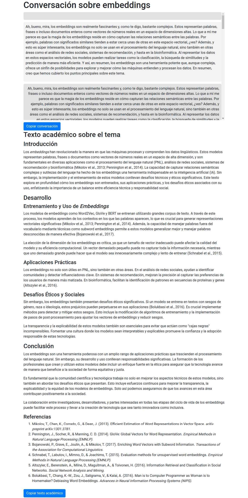

# 🤖 Academic IA Chat HTML 🌐

¡Bienvenido a Academic IA Chat HTML! Este proyecto es una aplicación de línea de comandos en Python que utiliza la API de OpenAI para generar conversaciones interactivas sobre un tema específico. Además, genera un texto académico basado en la conversación, listo para ser publicado en una revista científica. 🎓



## 🚀 Características

- 💬 Mantiene una conversación interactiva sobre un tema elegido por el usuario.
- 🧠 Genera respuestas naturales y coherentes utilizando el modelo de lenguaje GPT-4 Turbo de OpenAI.
- 📝 Crea un texto académico basado en la conversación, con una estructura adecuada para publicaciones científicas (introducción, sección principal, conclusión y referencias).
- 🌐 Genera un archivo HTML que muestra la conversación y el texto académico generado.
- 📋 Permite copiar fácilmente la conversación y el texto académico al portapapeles.
- 🔄 Admite diferentes tipos de conversación (amigos, trabajo, académicos) para adaptar el tono y el estilo de las respuestas.

## 📋 Requisitos

- Python 3.6 o superior
- Una clave de API de OpenAI (puedes obtenerla en https://beta.openai.com/signup/)

## 🚀 Instalación

1. Clona este repositorio:

```
git clone https://github.com/686f6c61/academic-iachat-html.git
```

2. Navega al directorio del proyecto:

```
cd academic-iachat-html
```

3. Crea y activa un entorno virtual de Python (opcional pero recomendado):

```
python3 -m venv env
source env/bin/activate  # En Windows, usa `env\Scripts\activate`
```

4. Instala las dependencias:

```
pip install -r requirements.txt
```

5. Configura tu clave de API de OpenAI editando el archivo `chat.py` y reemplazando `"API_KEY_OPENAI"` con tu clave real.

## 🚀 Uso

1. Ejecuta el script `chat.py`:

```
python chat.py
```

2. Introduce un tema para la conversación cuando se te solicite.
3. Introduce el número mínimo de respuestas que deseas en la conversación.
4. Introduce el tipo de conversación (amigos, trabajo, académicos).
5. La conversación interactiva comenzará, y podrás responder a las preguntas del asistente.
6. Una vez finalizada la conversación, se generará un texto académico basado en ella.
7. Se creará un archivo HTML en el directorio `chats/` con la conversación y el texto académico.
8. Podrás copiar fácilmente la conversación y el texto académico al portapapeles utilizando los botones proporcionados en el archivo HTML.

## 📄 Estructura del archivo HTML generado

El archivo HTML generado contiene la siguiente estructura:

- Encabezado con el título de la conversación y la hora actual.
- Estilos CSS para el diseño de la conversación y el texto académico.
- Contenedor principal con el título de la conversación.
- Contenedor de la conversación con los mensajes del usuario y del asistente.
- Botón para copiar la conversación al portapapeles.
- Título del texto académico.
- Contenedor del texto académico generado.
- Botón para copiar el texto académico al portapapeles.
- Script JavaScript para manejar la funcionalidad de copiar al portapapeles.

## 🤝 Contribución

Si deseas contribuir a este proyecto, ¡eres bienvenido! Puedes abrir un issue para reportar errores o sugerir mejoras, o enviar un pull request con tus cambios.

## 📝 Licencia

Este proyecto está licenciado bajo la [Licencia MIT](LICENSE).

## 📚 Recursos adicionales

- [Documentación de la API de OpenAI](https://openai.com/docs/introduction)
- [Guía de Markdown](https://www.markdownguide.org/)
- [Documentación de Python](https://docs.python.org/3/)

